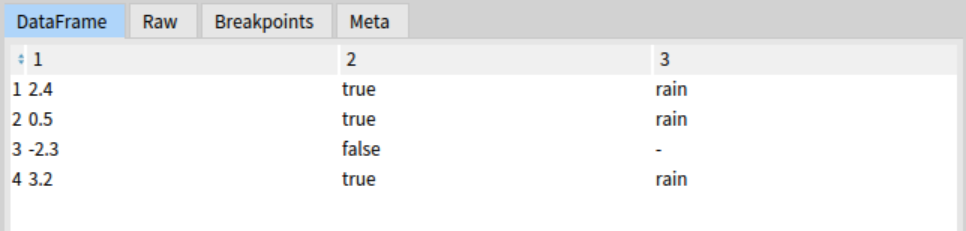
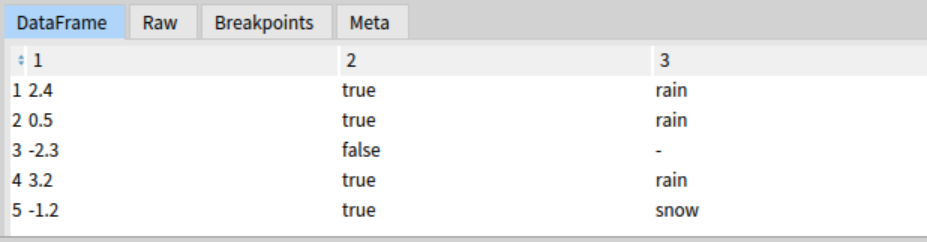
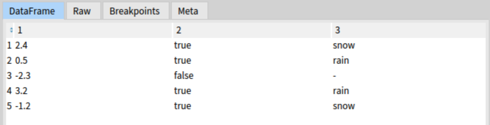
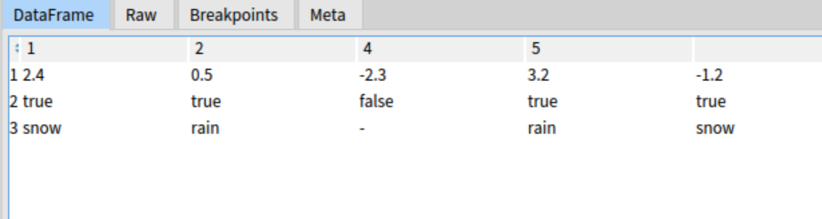

# Pharo DataFrame
[](https://github.com/PolyMathOrg/DataFrame/actions/workflows/test.yml)
[](https://coveralls.io/github/PolyMathOrg/DataFrame?branch=master)
[](https://raw.githubusercontent.com/PolyMathOrg/DataFrame/master/LICENSE)

DataFrame is a tabular data structure for data analysis in [Pharo](https://pharo.org/).


## Installation
To install the latest stable version of DataFrame (`pre-v3`), go to the Playground (`Ctrl+OW`) in your Pharo image and execute the following Metacello script (select it and press Do-it button or `Ctrl+D`):

```st
Metacello new
  baseline: 'DataFrame';
  repository: 'github://PolyMathOrg/DataFrame:pre-v3/src';
  load.
```

Use this script if you want the latest version of DataFrame:

```st
Metacello new
  baseline: 'DataFrame';
  repository: 'github://PolyMathOrg/DataFrame/src';
  load.
```

## How to depend on it?

If you want to add a dependency on `DataFrame` to your project, include the following lines into your baseline method:

```Smalltalk
spec
  baseline: 'DataFrame'
  with: [ spec repository: 'github://PolyMathOrg/DataFrame/src' ].
```

If you are new to baselines and Metacello, check out the [Baselines](https://github.com/pharo-open-documentation/pharo-wiki/blob/master/General/Baselines.md) tutorial on Pharo Wiki.

## What are data frames?

Data frames are the one of the essential parts of the data science toolkit. They are the specialized data structures for tabular data sets that provide us with a simple and powerful API for summarizing, cleaning, and manipulating a wealth of data sources that are currently cumbersome to use.

A data frame is like a database inside a variable. It is an object which can be created, modified, copied, serialized, debugged, inspected, and garbage collected. It allows you to communicate with your data quickly and effortlessly, using just a few lines of code. DataFrame project is similar to [pandas](https://pandas.pydata.org/) library in Python or built-in [data.frame](https://www.rdocumentation.org/packages/base/versions/3.5.3/topics/data.frame) class in R.

## Very simple example

In this section I show a very simple example of creating and manipulating a little data frame. For more advanced examples, please check the [DataFrame Booklet](#dataframe-booklet).

### Creating a data frame 

```Smalltalk
weather := DataFrame withRows: #(
  (2.4 true rain)
  (0.5 true rain)
  (-1.2 true snow)
  (-2.3 false -)
  (3.2 true rain)).
```

### Removing the third row of the data frame

```Smalltalk
weather removeRowAt: 3.
```


### Adding a row to the data frame

```Smalltalk
weather addRow: #(-1.2 true snow) named:''.
```


### Replacing the data in the first row and third column with 'snow'

```Smalltalk
weather at:1 at:3 put:#snow.
```


### Transpose of the data frame

```Smalltalk
weather transposed.
```


## DataFrame Booklet

For more information, please read [Data Analysis Made Simple with Pharo DataFrame](https://github.com/SquareBracketAssociates/Booklet-DataFrame) - a booklet that serves as the main source of documentation for the DataFrame project. It describes the complete API of DataFrame and DataSeries data structures, and provides examples for each method.

[](https://github.com/SquareBracketAssociates/Booklet-DataFrame)
