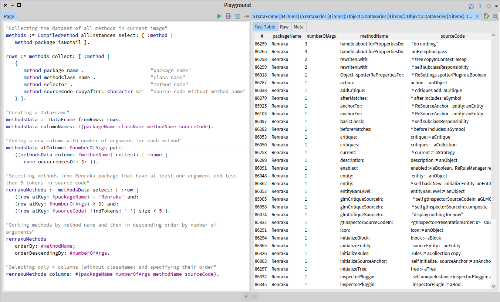

# Pharo DataFrame
[](https://travis-ci.org/PolyMathOrg/DataFrame)
[](https://ci.appveyor.com/project/olekscode/dataframe)
[](https://coveralls.io/github/PolyMathOrg/DataFrame?branch=master)
[](https://raw.githubusercontent.com/PolyMathOrg/DataFrame/master/LICENSE)
[](https://pharo.org/download)
[](https://pharo.org/download)
[](https://pharo.org/download)

DataFrame is a tabular data structure for data analysis in [Pharo](https://pharo.org/).

For more information, please read [Data Analysis Made Simple with Pharo DataFrame](https://github.com/SquareBracketAssociates/Booklet-DataFrame) - a booklet that serves as the main source of documentation for the DataFrame project. It describes the complete API of DataFrame and DataSeries data structures, and provides examples for each method.

## What are data frames?

Data frames are the one of the essential parts of the data science toolkit. They are the specialized data structures for tabular data sets that provide us with a simple and powerful API for summarizing, cleaning, and manipulating a wealth of data sources that are currently cumbersome to use.

A data frame is like a database inside a variable. It is an object which can be created, modified, copied, serialized, debugged, inspected, and garbage collected. It allows you to communicate with your data quickly and effortlessly, using just a few lines of code. DataFrame project is similar to [pandas](https://pandas.pydata.org/) library in Python or built-in [data.frame](https://www.rdocumentation.org/packages/base/versions/3.5.3/topics/data.frame) class in R.

[](https://raw.githubusercontent.com/PolyMathOrg/DataFrame/master/img/example.png)

## Installation
The following script installs DataFrame into the Pharo image

```smalltalk
Metacello new
  baseline: 'DataFrame';
  repository: 'github://PolyMathOrg/DataFrame/src';
  load.
```

## Example

This is a small example that will demonstrate how DataFrame can be used for collecting and preprocessing the dataset of methods. For more detailed information read the [DataFrame booklet](https://github.com/SquareBracketAssociates/Booklet-DataFrame).

### Collecting all methods from the image

First we collect an array of all methods in the image - instances of CompiledMethod class that belong to some package:
```Smalltalk
methods := CompiledMethod allInstances select: [ :method |
	method package isNotNil ].
```
From each method we extract its name, source code, package name, and class name. We remove first line of source code of each method to remove method's name from it:
```Smalltalk
rows := methods collect: [ :method |
  {
    method package name .
    method methodClass name .
    method selector .
    method sourceCode copyAfter: Character cr
  } ].
```
### Creating a DataFrame
We create a DataFrame and specify the names of its columns:
```Smalltalk
methodsData := DataFrame
  withRows: rows
  columnNames: #(packageName className methodName sourceCode).
```
### Adding a column
We add a new column with number of arguments for each method. To do that we count the number of occurences of `:` symbol in method's name:
```Smalltalk
methodsData
  addColumn: ((methodsData column: #methodName)
    collect: [ :name | name occurrencesOf: $: ])
  named: #numberOfArgs.
```
### Filtering data
Now we select only those methods that belong to package [Renraku](https://github.com/Uko/Renraku), have at least one argument, and source code with less than 5 tokens:
```Smalltalk
renrakuMethods := methodsData select: [ :row |
  ((row at: #packageName) = 'Renraku' and: 
  (row at: #numberOfArgs) > 0) and:
  ((row at: #sourceCode) findTokens: ' ') size < 5 ].
```
### Sorting rows by values of a column
First we sort methods by their names and then we sort the result by number of arguments in descending order:
```Smalltalk
renrakuMethods
  sortBy: #methodName;
  sortDescendingBy: #numberOfArgs.
```
### Selecting specific columns
We selecting only 4 columns (without className) and specify their order. If you inspect the result of this query, you will see the table similar to the one in a screenshot above.
```Smalltalk
renrakuMethods columns: #(packageName numberOfArgs methodName sourceCode).
```
